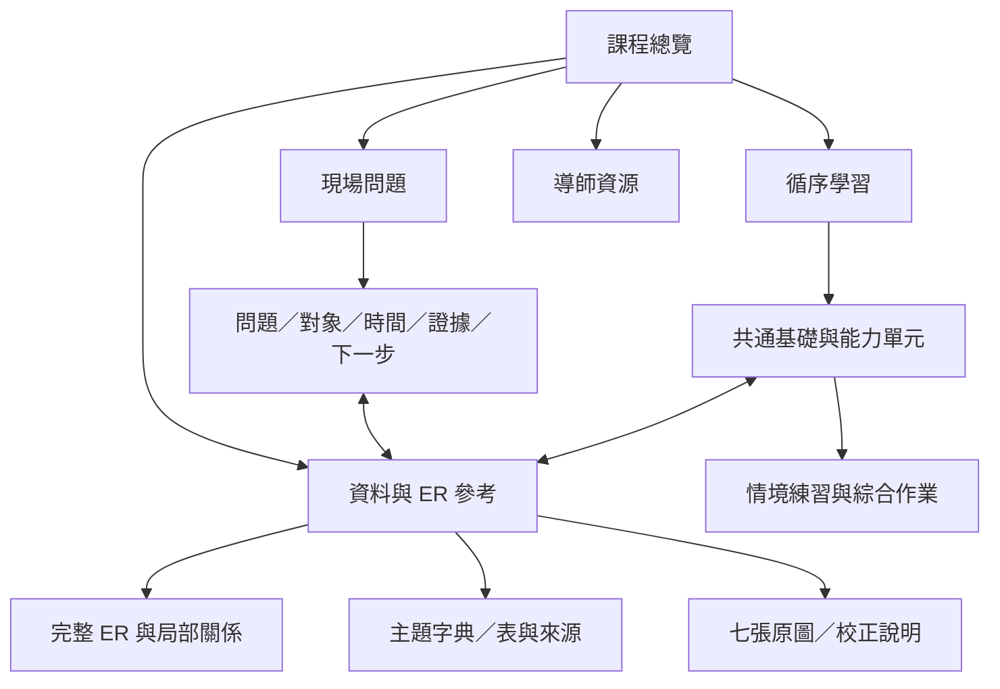

# MES 教學網站整體架構審查與重編建議

日期：2026-09-13｜MES-053｜狀態：設計建議，尚未實作新版網站

## 1. 結論與建議決策

建議把網站整理成「循序學習、現場問題、資料與 ER 參考」三個互通入口，共用同一套主題定義與圖文。首頁負責引導讀者選路；課程負責建立能力；任務頁負責串聯查詢手順；完整 ER 負責精確探索與來源追溯。

現在的主要問題是課程架構沒有跟上內容擴充。已有很多適合保留的專屬圖、互動和廠內定義，但讀者仍需自行把散落主題組成工作知識。下一輪最值得先做的是課綱、內容歸屬和跨頁路徑，再按需要補橋接教材。

建議採用下列決策：

1. 新增真正的課程總覽，第一課仍保留既有深連結。
2. 建立共通基礎，再依現場／資料用途分流；不用四份重複課程服務四個角色。
3. 保留完整 ER、原圖與來源鍵；課程地圖是學習導覽，不取代 ER。
4. 每個主題有穩定網址、所屬章節、先備知識與返回脈絡，不再只能躲在 ER 右側。
5. 先完成「Lot 為什麼尚未進機」一條跨課、跨 ER 的完整原型，以真人試讀再決定批量遷移。
6. 保留已完成專屬圖片與情境；全站換圖、登入帳號、複雜學習管理系統都不是第一階段必要工作。

## 2. 審查方式與證據界線

四位獨立 agent 分別模擬半導體新手工程師、資深 Data Scientist、資深製造現場工程師及授課導師。這些是分析視角，並非四位真人的訪談結果。各自閱讀網站來源後撰寫報告，主代理再核對執行時畫面與操作；沒有用多數意見代替證據。

- [新手工程師報告](ROLE-NOVICE.md)
- [Data Scientist 報告](ROLE-DATA-SCIENTIST.md)
- [製造現場工程師報告](ROLE-MANUFACTURING.md)
- [授課導師報告](ROLE-INSTRUCTOR.md)
- [執行時頁面、課節與主題盤點](../../tests/evidence/mes-053/inventory.json)
- [實際操作路徑紀錄](../../tests/evidence/mes-053/journeys.json)
- [現有內容遷移對照](CONTENT-MAP.md)

本輪讀取十個現有入口，在 1440 與 390 寬度載入並保存二十張首屏截圖。入口均回應 HTTP 200，當次觀察無頁面 JavaScript 錯誤與整頁水平溢出。主代理實看代表畫面：首頁桌機、設備課手機、延伸課桌機、ER 手機。其餘首屏保存但未逐張做視覺評價；沒有逐一重看全部課節、所有插圖或所有互動分支。

瀏覽器外掛未提供可用瀏覽器，改以本機 Playwright 執行唯讀檢查。實際點擊確認兩課課末行為，以及 ER 主詞切換／返回、ER→設備教材→返回。以上證據只能支持載入及所測操作，不能證明教學成效。沒有評全站品質分數，也沒有把舊測試通過視為新架構已驗收。

## 3. 現況診斷：問題在哪一層

| 問題 | 本輪證據 | 對讀者的影響 | 建議 |
|---|---|---|---|
| 首頁同時是第一課 | `index.html` 與 index-1440.png：直接进入 Fab 課，課前有醒目 ER 捷徑 | 尚未建立物件概念即需決定是否進大型資料圖 | 總覽提供開始／繼續／查問題；保留專家直接進 ER |
| 課綱按增補歷程長大 | `course.js` 基底四部分，`course-extension.js` 另加時間與配方、ER；advanced/support 各自導覽 | 有入口，但不知道哪些是接續、先修或參考 | 全站共用一份課綱與主導覽 |
| 前後課方向不連貫 | 實測 operations/flow `#lab` 主按鈕都回本課開頭；Flow 的另一路課尾連結回 index | 完成後容易繞圈，第四課未形成自然接續 | 主操作前往下一課，重讀作次操作 |
| 先使用，再補必要定義 | 設備課使用 Step、Flow 版本與資格，Flow 才在後課完整介紹 | 新手需要暫存太多未知名詞 | 前置最小 Flow／Step 模型，細節逐步深化 |
| 課程與參考資料雙軌生長 | 許多新主題在 `er-topic-content.js`；核心課仍是其他 renderer | 一主題已補圖不等於所有入口已同步 | 內容共用，課程／ER 是不同呈現方式 |
| ER 操作與學習位置混在一起 | 手機 ER 首屏有模式、框選、展開、返回、主詞及關係工具 | 可操作但需同時理解太多層次 | 新手使用帶問題的局部任務；自由探索保留完整工具 |
| 返回存在，課程脈絡仍不足 | journeys.json 顯示 ER 返回及教材往返成功 | 瀏覽歷史可恢復，不等於知道下一課學什麼 | 分別呈現課程位置與瀏覽来源 |
| 類似詞跨課語境不同 | Move 進機計數／完成後推進；Finished／E 出貨；Port／機台 UP、LOST | 表面同詞可能被誤套成同一事件 | 用具體對象、事件範圍與時間就地對照，不直接判定所有例子錯誤 |
| 製作比較內容進入學員主線 | `advanced` 有 Flow 四種教法比較；`course-extension.js` 在導入插入「新增」連結 | 學员需要判斷教法版本，而非只學製造概念 | 正式課採一個主版本；教法比較移到導師／版本參考 |
| 覆蓋數量代替能力覆蓋的風險 | 121 ER 節點与大量主題皆可找資料，但仍缺共同的跨題作業 | 看過很多表，仍不會解決完整問題 | 用能力矩陣與情境任務驗收 |

動態注入很重要：只讀 `course.js` 會誤判頂部僅四入口，本輪已核對 `course-extension.js` 並修正角色報告。往後內容稽核也應以最終畫面為準。

## 4. 四個角色的需求與取捨

| 角色 | 首要任務 | 不希望遇到 | 架構回應 |
|---|---|---|---|
| 半導體新手 | 建立物件、流程與事件的基本模型 | 一開始就猜表名、縮寫或 ER 操作 | 明確主線、少量先備、逐課回饋、就地詞彙 |
| 資深現場工程師 | 快速查一批貨或設備的問題 | 為找一筆資料被強迫重上所有基礎 | 任務直達、可跳先修、帶 Lot／時間上下文 |
| 資深 Data Scientist | 建立可驗證的關聯與分析範圍 | 把關係線當 Join 保證，或把快照當即時 | 對象／粒度／時間／基數／來源的資料閱讀卡 |
| 授課導師 | 安排先備、判斷誤解、看能力成長 | 只有頁數與漂亮圖，沒有學習證據 | 成果對齊練習、跨章案例、教案與評量依據 |

幾項需要裁決的差異：

- **ER 何時出現？** 新手希望較晚；資料角色希望及早連結。採「早給單一關係、晚教完整探索」：第一章可選看 Lot–FOUP 關係，完整讀圖方法安排在資料分析階段；專家隨時直接進圖。
- **資料新鮮度何時教？** 不全部延到最後。第一章即問「是哪個時間」，後續每例標示資料時間，最後再完整處理晚到、契約與時間對齊。
- **課綱排八章或九章？** 不以章數作目標。以下十個能力單元包含開場與綜合作業；單元可拆短節，也可合堂教，不要求新增十個大型 HTML。
- **是否先教完整 PD／Recipe？** 新手先懂本站要求與設備执行；LR／ER／Physical 與映射細節按用途展開，避免第一輪塞滿縮寫。
- **是否新增 AI 資料集課？** DS 提議有價值，但列選修。先完成 MES 資料判讀與關聯驗證，不讓 AI 擴充再擠壓主課程。

## 5. 建議網站資訊架構

這是網站導覽示意，線表示頁面入口，不表示 MES 加工順序或資料 Join。

**總覽第一屏**：一句說明本課能幫助哪些工作、開始學習、繼續上次、查現場問題。ER 直接入口保持可見。下方提供完整課程地圖、各單元成果與先備，讓學員自己判斷需要什麼。讀過與作答通過分開顯示；沒有歷程時不顯示假進度。

**循序學習**：同一套核心內容，提供「新手完整路線」「現場重點」「資料分析重點」推薦清單。先備是提示，可自行跳過，不作阻擋專家的門禁。

**現場問題**：以問題索引，不要求已知表名。每題包含對象與時間、查詢步驟、可能分支、來源與不足、返回原任務；只教查詢與判讀，不讓教材看似真實 MES 派工或放行介面。

**資料與 ER 參考**：表名、別名及工作術語都可搜尋；結果標示是概念、表、關係或任務。整合 ER 為主要探索介面，原七圖為來源；主詞小圖是同資料的閱讀投影。`subject-er.html` 與其他舊入口先保留相容，決定是否轉址前完整盤點功能，不直接刪除。

**導師資源**：教案、誤解清單、案例答案、版本比較放次要入口，避免學員主線混入製作過程。無須先做帳號系統。

## 6. 建議課綱：能力與先備先於檔案

課程定位建議為「半導體製造資料判讀與查詢入門」。學完應能指定查詢主詞、分清物理位置與流程位置、判別安排與實際事件、選擇適合時間的來源，並交付有依據與限制的答案。它不承擔完整半導體製程訓練、真實 MES 操作資格或 SQL 全科教學的責任。

| 單元 | 工作問題與內容 | 先備 | 學完的可觀察成果／練習 |
|---|---|---|---|
| 0 如何使用本課 | Fab 工作全景、三種入口、概念／資料／事件圖例 | 無 | 找到適合路線；知道教材情境不是真實控制 |
| 1 物件、身分與位置 | Wafer、Lot、FOUP、Slot；多 Lot 同載具、25片；最小時間觀念 | 0 | FOUP 換裝後，分清哪個 ID、歸屬、槽位改變 |
| 2 產品怎麼定義加工路線 | PART／Flow／Route／mainpd_id；Module→Stage→Step；Lot 當前站；版本 | 1 | 指出「應走的路」與「此批目前位置」；新版不自動證明所有 WIP 遷移 |
| 3 一站如何加工 | EQP、Load Port、Chamber、PD／Recipe；資格、可用設備、RQHBE 基礎；CW／MON／PM 入口 | 1、2 | 區分有貨、可用、加工中、本站完成；細部配置按需展開 |
| 4 安排與搬送 | 預派／歷史、Stocker／Default STK、OHT／OHB／BMIR、Port模式、MCS Macro/Micro、presum | 1、3 | 追一個 FOUP 的時間與位置；辨認預派與實際進機不同 |
| 5 管制與例外 | Hold、Future Hold、Product Hold、QTime、SRTS、Bank、Sub Route／重工；設備限制 | 2、3 | 依情境選限制來源；區分規則設定、觸發與執行紀錄 |
| 6 重建一批貨的歷程 | 批貨歷史、Lot Step、Move、拆合批、Wafer／FOUP內容物歷史 | 1–5 核心 | 按時間重建；重工另一次進機，搬送不是 Move；分清本站完成與 E出貨 |
| 7 後續站點何時到 | Flow＋IE WPH→預估；forecast；Stream 歷史與 LDS 替代註記 | 2、6 | 解釋累計到站概念、假設與預測／實際差異；不虛構正式算法 |
| 8 機群管理與可信資料分析 | Bay／Owner、機群／Chamber／SQL虛擬群、KER；最近／每小時／每日07:20；完整新鮮度、ER與關聯驗證 | 3、6；7可選 | 選正確對象與時窗，解釋多群重複與資料晚到；不自行推EFF公式 |
| 9 綜合工作任務 | 找貨、未進機、查歷史、品質攔截、機群報表 | 依任務 | 交付可重做的查詢說明：已知／缺證據／來源／下一步 |

單元 8 範圍較大，應分為「管理對象」「資料時間」「ER與關聯驗證」三個短模組。現場路線可先學管理與快照，DS 路線再深化 Join、重複計數與資料契約。正式課長與每節時長需試教決定，本報告不把估計時數寫成已驗證負荷。

先備補充：單元3先用一句話及小例介紹「機群是設備的集合」，並在單元7推估之前說明 WPH 是預期產出標準及其單位。多重分群、獨立Chamber與彙總問題留在單元8，避免先使用WPH卻還不知道它描述誰。

## 7. 四條建議使用旅程

| 旅程 | 順序 | 應保留的上下文 |
|---|---|---|
| 新人自學 | 總覽→0–3→第一個情境→4–6→依工作選7/8→綜合作業 | 單元、節、作答、最後閱讀位置 |
| 現場找貨 | 問題→指定FOUP與查詢時間→搬送/位置→當時裝載→相關ER→回問題 | FOUP、時間、原問題與選取節點 |
| DS查資料 | 問題→對象與一筆粒度→時間契約→ER關聯→前後筆數→限制 | Lot/機群範圍、期間、來源、查詢假設 |
| 導師授課 | 目標→導入案例→共同示範→學員解釋→變化題→依錯因回補 | 本堂成果、題目版本、解答與誤解紀錄 |

所有路線可自由轉換；轉換要顯示「從哪個任務／課節來」，並提供回到原處。路線不應複製內容或改寫同一術語定義。

## 8. 代表原型：Lot L023 為什麼尚未進機？

此題最適合先做，因為跨越身份、站點、管制、可用設備、預派、搬送、Port 與真實事件，可以驗證新架構是否真的串起知識。

**輸入情境**：教學 Lot L023，查詢時刻 T，已預派 EQP-A，Port 顯示 UP，Lot 仍為 Q。此情境的值為假設，不是真實廠內資料。

| 步驟 | 學員問題 | 可用教材 | 可判定範圍 |
|---|---|---|---|
| 1 | 我查的是哪批、哪一站、何時？ | Lot、PART／Flow、Lot Step | 先固定對象及時間，不拿目前值替歷史 |
| 2 | 是否有有效管制或缺少條件？ | RQHBE、Hold、QTime、資格 | 依證據列出限制，不由 Q 自動推定卡在某原因 |
| 3 | 可用機台與已預派是哪個？ | available、PD／Recipe、預派 | 可用與安排分別解讀 |
| 4 | 承載它的 FOUP 是否到位？ | 裝載、MCS、OHB／Port | Port UP 證明有貨；仍須核對載具、批次與時間 |
| 5 | 是否有實際進機證據？ | 批貨歷史、Move、狀態 | 進機證據與完成證據分開；來源尚未更新則先列不足 |
| 6 | 下一步能交接什麼？ | 資料契約與證據摘要 | 輸出已知、不能斷言、下一個查詢 |

這是教學診斷順序，不是廠內 RTD 演算法或固定放行流程。每步只給必要局部關係，完整 ER 可選開；回來時題目進度不丟失。

變化題應至少包括：預派但尚未搬到、Port UP 但不是該批、資料延遲而不能判斷、Lot有有效Hold。答案解釋「哪些證據支持什麼」，而不只是紅綠正誤。

原型前兩節明確涵蓋「物件／批次／位置」及「流程位置／安排與執行」。任務內另外提供管制、進機事件與資料延遲的就地微解說，並允許返回重看；不要求只讀兩節的新手憑空知道Move或時間契約。試讀時分別記錄「概念尚未學會」與「找不到入口」，才能判斷是哪一種設計需要修正。

## 9. 頁面與操作的一致規則

每課採一條閱讀路徑：工作問題→案例／圖→關鍵區別→小型操作或判斷→依據與結果→下一課。資料表與詳細限制放在相關段落旁可展開，不用每頁先堆一大段縮寫。

導覽要明確区分：

| 控制 | 意義 | 狀態規則 |
|---|---|---|
| 上一課／下一課 | 課綱順序 | 不受剛才點了哪張 ER 影響 |
| 返回剛才的任務／主題 | 瀏覽來源 | 恢復來源、選取、題目及捲動 |
| 沿關係上一點／下一點 | ER 某條路徑 | 不改成課程前後節 |
| 關閉放大 | 返回原圖位置 | 焦點回開啟按鈕；不清掉選取 |
| 回課程總覽／ER全圖 | 明確目的地 | 不以「上一頁」模糊代替 |

從外部深連結直接進來，即使沒有原 session，也必須看得到所屬章節與明確退路。全站只採一套標題層級與導覽命名，手機按「問題→局部圖→解說→行動」順序閱讀，不要求反覆橫向對照。

搜尋支援廠內已確認別名，例如 Product／PART、Flow／Route／mainpd_id；依對象顯示 Port UP 與機台 UP，避免同字誤合併。搜尋結果應帶一句用途及內容類型。

## 10. 內容與圖文維護架構

建议從現有來源逐步抽出共同內容目錄，不需立刻換框架。每個概念有穩定 `topicId`，每個課節有 `lessonId`，任務引用主題；表和關係引用原始 source ref。不同頁的正文深度可以不同，定義與資產來源應一致。

每主題最低資料：名稱／別名、白話定義、適用對象、所屬單元、先備、相關主題、來源refs、專屬桌機／手機圖及替代文字、定義確認狀態、變更記錄。每資料對象另列一筆粒度、時間角色、可回答範圍、關聯條件及未確認項。

保留「使用者確認」「原圖證據」「教學假設」「待確認」四種來源狀態。將執行時語意校正集中成可查的校正清單，原始圖仍可追溯；避免後段 Object.assign 使不同 renderer 抽到不同版本。

案例採共同身份與版本，但不假裝所有圖片是同一次事件。L023主案例、獨立小例各有 `caseId` 和時間／流程範圍。狀態圖、事件時間軸、規則設定圖、預測圖與ER使用不同的明確圖例；RQHBE不得畫成必經直線。

新圖只在缺少因果、對照或跨課橋接時新增。現有專屬圖優先沿用；不以通用 FOUP 圖補每個空位。既有多種 Flow 教法先選一個正式主線版本，其餘放導師參考。

## 11. 遷移順序與完成條件

| 階段 | 交付 | 完成條件 |
|---|---|---|
| P0 盤點及定義 | 本次報告、內容對照、明確單元成果、舊URL清單 | 每個現有主題有主歸屬；撤下與舊系統明示；未確認事項不補造 |
| P1 架構原型 | 課程總覽、共用導覽、代表任務、ER往返、兩節基礎教材 | 桌機/手機實際從首頁走完、外部深連結能定位、關閉放大與瀏覽器返回可用 |
| P2 核心內容遷移 | 單元1–6、詞彙一致、原情境接回主線 | 舊URL/錨點仍可達；已確認語意在正文/圖/參考一致；情境狀態保留 |
| P3 資料與管理路線 | 單元7–9、KER/新鮮度/ER、綜合任務 | 多群與時點題可解釋；不把資料缺失說成零；不虛構SQL或公式 |
| P4 試教修正 | 真人試讀、錯因統計、按證據改善 | 以相同任務前後比較，修掉主要迷路及概念誤解再擴大使用 |

各階段保留可回復版本。共享導覽更改後，要重測受影響入口；不沿用舊截圖當新版證據。先相容再收斂，不能直接刪舊入口或搬走資產而使來源連結失效。

FRPORT_UDATA 維持撤下教學；Stream明示已由LDS取代，放歷史參考。不能把未確認被取代的其他forecast一起淘汰。EFF公式與彙總依使用者指示暫不展開。

## 12. 驗收要看學會什麼

功能驗收與學習驗收分開。功能包括讀取、深連結、搜尋、鍵盤操作、返回、手機與狀態保留；學習驗收要求學員在新情境下說明理由。

| 任務 | 學會的證據 | 主要角色 |
|---|---|---|
| 初次進站，找下一課 | 能說出自己在哪、為何學這課、下一步 | 新手 |
| 同 FOUP 兩 Lot、歷史換裝 | 分清身分／歸屬／位置與時間 | 新手、現場 |
| 預派＋Port UP＋Lot Q | 說明資料可同時成立，仍缺哪種進機證據 | 全部 |
| 同站重工、一次事件重送 | 分清兩次進機與重複資料；實際唯一鍵不足就提出缺口 | 現場、DS |
| 09:00讀07:20快照 | 不當即時，不把快照時點當指標窗口 | 全部 |
| EQP同屬兩機群 | 分清群成員數與設備聯集；不自動平均比率 | DS、管理 |
| Product Hold 未到/已到站 | 分清設定、觸發與實際紀錄 | 現場 |
| 課程→ER→放大→教材→返回 | 同任務、同段落與可理解的下一步 | 全部 |

先找少量代表做探索性试读（例如3–5名新手，再有現場與資料角色），記錄正確解釋、完成與否、提示次數、迷路點、返回後狀態。這個樣本用於發現缺陷，不用來宣稱整體成效或統計顯著。

不以看完頁面等同通過；不以 agent 評分代替真人學習。建議導師為關鍵題定義必須答對的概念與可接受替代推理，實測前不填成功率。

## 13. 待確認項與建議下一步

架構設計已足夠開始原型，不需先把所有廠內欄位問完。下一階段可能影響安排的是：核心學員比例、授課或自學為主、可用學習時間、是否要求實作SQL。先按「新手可自學、現場與DS可直接查詢」設計，試讀再調整。

資料細節延後到相應教材製作才確認：Sampling的抽樣單位、真實表粒度與事件識別、更新與有效時間、RTD選貨細節、LDS介面，以及可用的匿名教學資料。不能把這些空白補成廠內事實。

推薦下一個具體工作是 P1 原型，包含總覽、兩節必要基礎與「Lot尚未進機」任務，復用已驗過的圖及互動，打通完整往返。原型先證明讀者能找到路、理解層次，再決定整站搬移。這份文件完成的是審查與建議，網站重構尚未開始。
